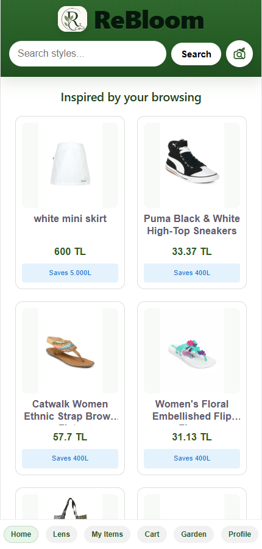
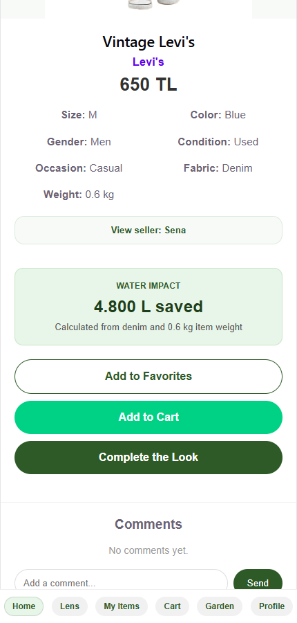
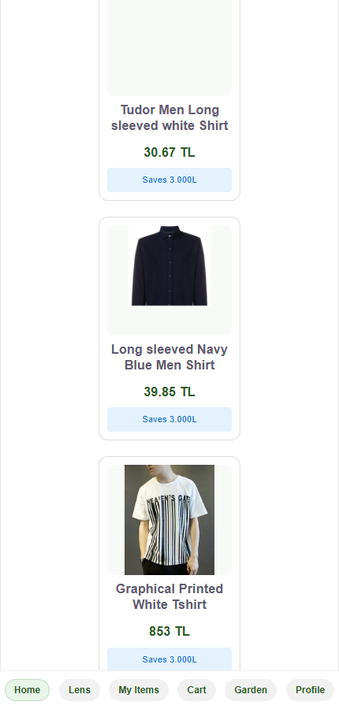
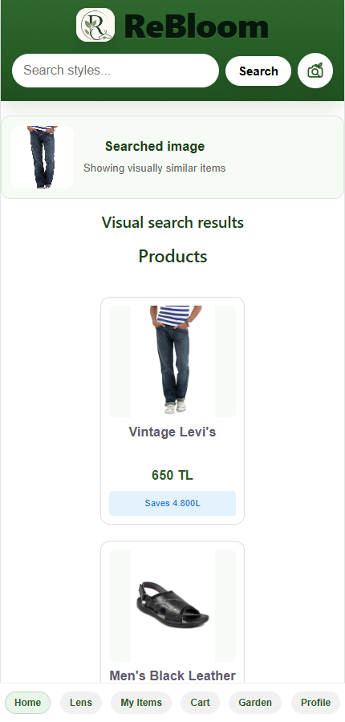
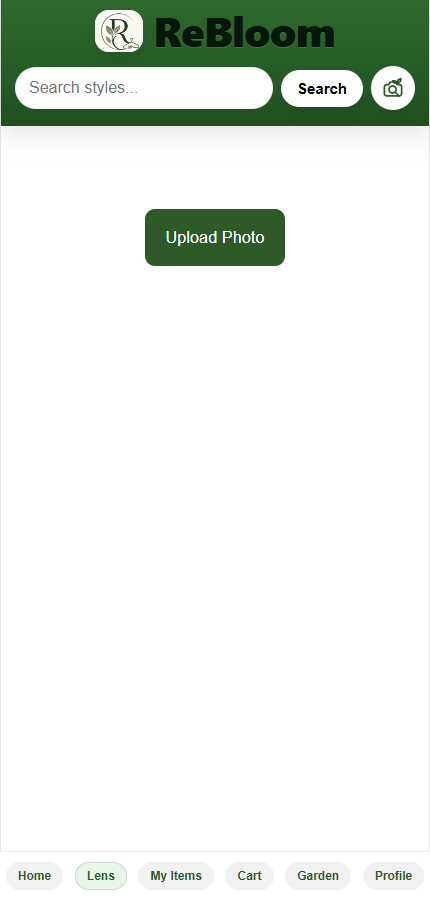
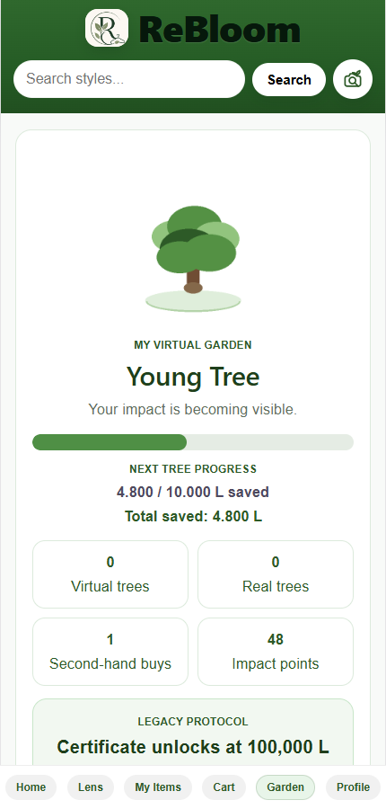
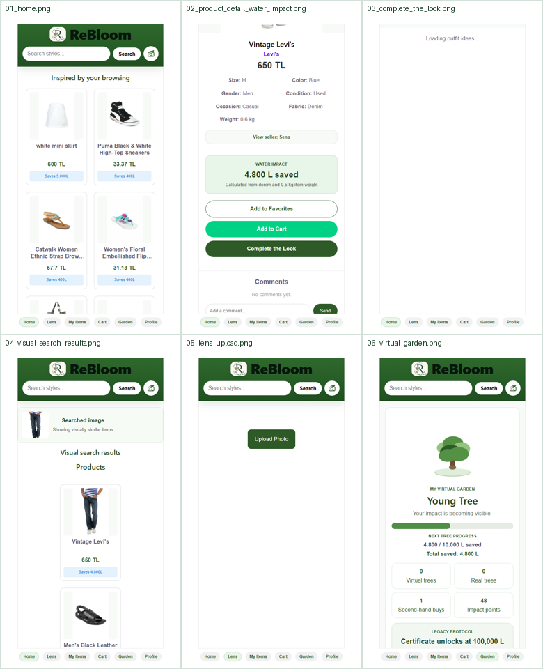

# 🌱 ReBloom

> AI-powered sustainable second-hand fashion marketplace built with **React**, **FastAPI**, and **Computer Vision** to encourage sustainable fashion through intelligent recommendations and visual product search.

---

## 🚀 Overview

ReBloom is a graduation project developed to make second-hand fashion smarter, more accessible, and environmentally friendly.

The platform combines modern web technologies with Artificial Intelligence to help users:

- 👕 Buy and sell second-hand clothing
- 🔍 Search visually similar products
- 🎯 Receive AI-powered clothing analysis
- 👗 Discover compatible outfit combinations
- 🌍 Understand the environmental impact of their purchases

---

# ✨ Features

### 🔍 AI Visual Search

Upload an image and instantly find visually similar clothing items using CLIP image embeddings.

---

### 👕 Clothing Classification

Automatically predicts clothing categories using machine learning models trained on the DeepFashion2 dataset.

---

### 🎨 Clothing Analysis

Analyzes product images and predicts:

- Category
- Color
- Pattern
- Fabric
- Estimated Weight

---

### 👗 Outfit Recommendation

Generates outfit compatibility recommendations using image embeddings and the Polyvore dataset.

---

### 🌍 Sustainability Impact

Estimates the environmental impact of clothing based on:

- Fabric type
- Estimated garment weight
- Water consumption

---

### 🛍 Marketplace

Users can:

- Create listings
- Browse products
- Manage profiles
- Explore AI-enhanced shopping features

---

# 🛠 Tech Stack

## Frontend

- React
- JavaScript
- Vite

## Backend

- Python
- FastAPI
- REST APIs

## Machine Learning

- CLIP
- scikit-learn
- DeepFashion2
- Polyvore Dataset
- Image Embeddings

## Database

- SQLite

## Development Tools

- Git
- GitHub
- VS Code

---

# 🧠 AI Pipeline

```text
User uploads image
        │
        ▼
Image Processing
        │
        ▼
CLIP Image Embeddings
        │
        ▼
Similarity Search
        │
        ├────────► Clothing Classification
        │
        ├────────► Outfit Recommendation
        │
        └────────► Sustainability Analysis
```

---

# 📂 Project Structure

```text
ReBloom
│
├── frontend/        React application
├── backend/         FastAPI backend
├── scripts/         AI and utility scripts
├── docs/            Documentation & screenshots
└── README.md
```

---

# 💻 My Contributions

As an **AI Engineer & Full-Stack Developer**, I contributed to:

- Designing and developing React frontend features
- Developing FastAPI backend services
- Integrating frontend and backend through REST APIs
- Implementing AI-powered image search
- Building recommendation pipelines
- Training and evaluating machine learning models
- Integrating CLIP image embeddings
- Developing sustainability impact calculations
- Debugging and testing application features
- Collaborating through Git and GitHub

---

# 📊 Machine Learning Models

The project evaluates multiple classification algorithms:

| Model | Purpose |
|--------|----------|
| Logistic Regression | Clothing Classification |
| Linear SVM | Clothing Classification |
| Random Forest | Clothing Classification |
| Multi-Layer Perceptron | Clothing Classification |

Evaluation Metrics

- Accuracy
- Precision
- Recall
- F1 Score

---

# 📸 Screenshots

## 🏠 Home Page

Browse the marketplace and discover sustainable second-hand fashion products.



---

## 💧 Product Details & Sustainability Impact

View detailed product information together with estimated environmental impact.



---

## 👗 Complete the Look

Receive AI-powered outfit recommendations based on clothing compatibility.



---

## 🔍 AI Visual Search Results

Upload an image and find visually similar clothing items using AI.



---

## 📷 Lens Upload

Upload a clothing image to start an AI-powered visual search.



---

## 🌳 Virtual Garden

Track your sustainability impact through the virtual garden feature.



---

## 📋 Contact Sheet

Overview of the application's main screens.



---

# 🚀 Future Improvements

- Mobile application
- React Native support
- Personalized recommendations
- AI chatbot assistant
- User authentication improvements
- Carbon footprint estimation

---

# 🎓 Academic Project

Developed as the Computer Engineering Graduation Project at

**Antalya Bilim University**

---

# 👩‍💻 Author

**Sena Reyyan**

Computer Engineer

GitHub:
https://github.com/Cansucansu3
